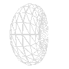
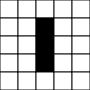

# Game of Life - [See live version here](https://nathansmithbz.github.io/portfolio/gameOfLife.html)
 
An example of the Game of Life written in the JavaScript library [p5.js](https://p5js.org/).

The Game of Life is set in an infinite two-dimensional grid inhabited by “cells”. Every cell interacts with up to eight neighbours, which are the cells that are horizontally, vertically, or diagonally adjacent. From an initial seed grid the game "evolves" one iteration at a time. An iteration applies rules to the grid to determine its next state.
Rules

    When a live cell has fewer than two neighbours -> The cell dies
    When a live cell has more than three neighbours -> The cell dies
    When a live cell has two or three neighbours -> The cell lives
    When an empty position has exactly three neighbouring cells -> A new live cell is created at this position

    
## Assumptions 

This implementation of the Game of Life assumes each edge is connected to the opposite edge. For Example:

| 0,0 | *_0,1_* | 0,2 |
| -- | -- |-- |
| **_1,0_**| 1,1 | *_1,2_* | 
| 2,0 | *_2,1_* | 2,2 |

In the above example the left hand neighbour to the cell at position 1,0, would be 1,2.

Additionally, the neighbour directly under the cell at position 2,1 would be 0,1.

This creates a connected grid that can be visualised as a torus:

## Testing

Once developed this implementation was tested on a small grid seeded with three horizontally adjacent live cells. After the rules are applied these cells should switch repeatedly between 3 vertically aligned live cells and three horizontally aligned live cells. This behaviour was observed and capture as seen below:

(Live cells are filled in black)

_Gifs created using_ [_ccapture.js_](https://github.com/spite/ccapture.js/) forked and edited [here.](https://github.com/nathansmithbz/p5js-animation-to-png-template/blob/main/js/sketch.js)

# [See live large randomly seeded version here](https://nathansmithbz.github.io/portfolio/gameOfLife.html)
 

